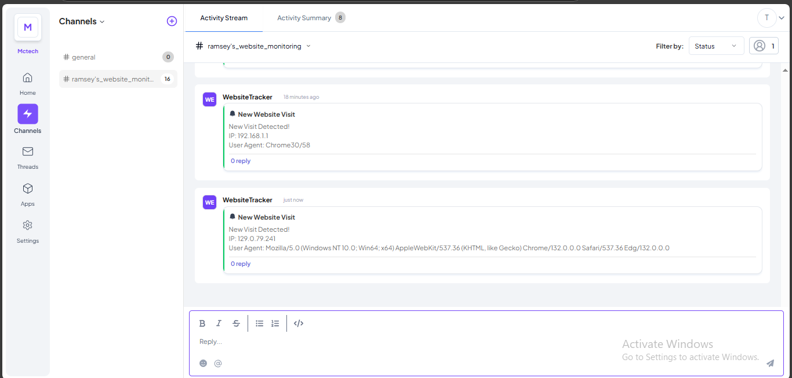

# wesite_traffic_tracking

 

This is a simple Node.js backend application that monitors traffic on the website [Color Game](https://color-game-39n9.onrender.com). It captures the user's IP address and browser user agent, then sends this information to a Telex channel via a webhook.

## Features

- Monitors website traffic by capturing user IP and user agent.
- Sends traffic information to a specified Telex channel.
- Easy to set up and configure.

## Technologies Used

- **Node.js**: JavaScript runtime for building server-side applications.
- **Express**: Web framework for Node.js to build APIs.
- **CORS**: Middleware for enabling CORS (Cross-Origin Resource Sharing).
- **Axios**: Promise-based HTTP client for making requests.
- **dotenv**: Module for loading environment variables from a `.env` file.

## Installation

1. Clone the repository:

   ```bash
   git clone https://github.com/McTech6/wesite_traffic_tracking.git
   cd wesite_traffic_tracking
Install the dependencies:
bash

 
npm install
Create a .env file in the root directory and add the following:
env

 
TELEX_WEBHOOK_URL=https://ping.telex.im/v1/webhooks/0195186a-2d99-7f9c-924a-dbece90fd7d9
PORT=5000

Usage
Start the server:
bash

Copy
npm run dev
Access the API:
Welcome Route: GET /
Integration File: GET /integration
Track Visit: POST /tick
Request body should include:
json

Copy
{
  "ip": "user_ip_address",
  "userAgent": "user_browser_info"
}
Example Request
Here's an example of how to send a request to the /tick endpoint:

curl -X POST http://localhost:5000/tick \
-H "Content-Type: application/json" \
-d '{"ip": "192.168.1.1", "userAgent": "Mozilla/5.0"}'
Contributing
Contributions are welcome! Please feel free to submit a pull request or open an issue.




License
This project is licensed under the ISC License.

Author
Tidding Ramsey
